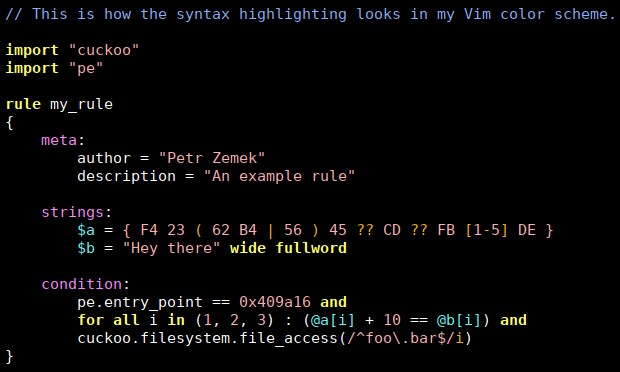

# Vim Syntax Highlighting for YARA Rules

A Vim syntax-highlighting file for [YARA](https://virustotal.github.io/yara/)
rules. Covers YARA versions up to v4.3.



## Installation

If you use [pathogen](https://github.com/tpope/vim-pathogen), simply go
into the `bundle` directory and clone the repository in there:
```
cd ~/.vim/bundle
git clone https://github.com/s3rvac/vim-syntax-yara.git
```
You can also install the plugin manually by copying the
[`syntax/yara.vim`](https://raw.githubusercontent.com/s3rvac/vim-syntax-yara/master/syntax/yara.vim)
file to your `~/.vim/syntax` directory and the
[`ftdetect/yara.vim`](https://raw.githubusercontent.com/s3rvac/vim-syntax-yara/master/ftdetect/yara.vim)
file to your `~/.vim/ftdetect` directory. If these directories do not exist,
create them.

## License

Copyright (c) 2017 Petr Zemek (s3rvac@petrzemek.net) and contributors.

Distributed under the MIT license. See the
[`LICENSE`](https://github.com/s3rvac/vim-syntax-yara/blob/master/LICENSE)
file for more details.
